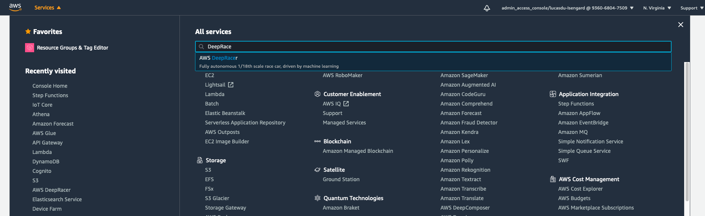
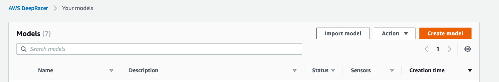
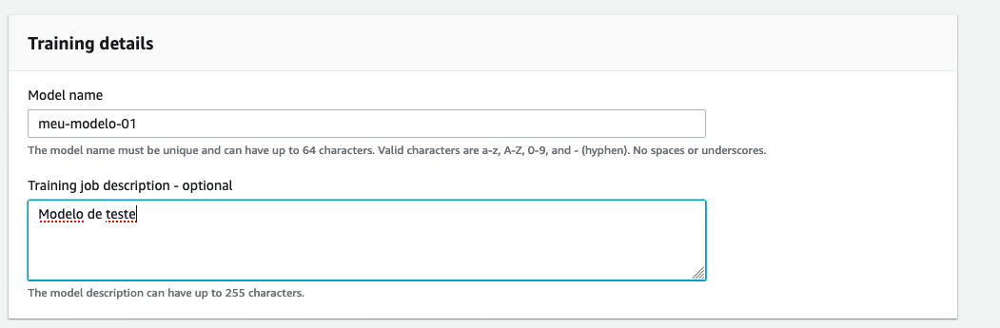
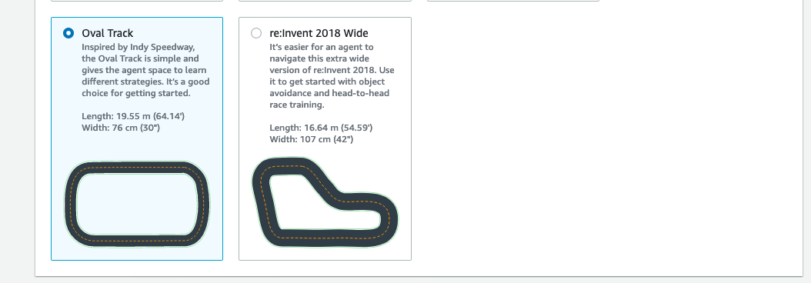
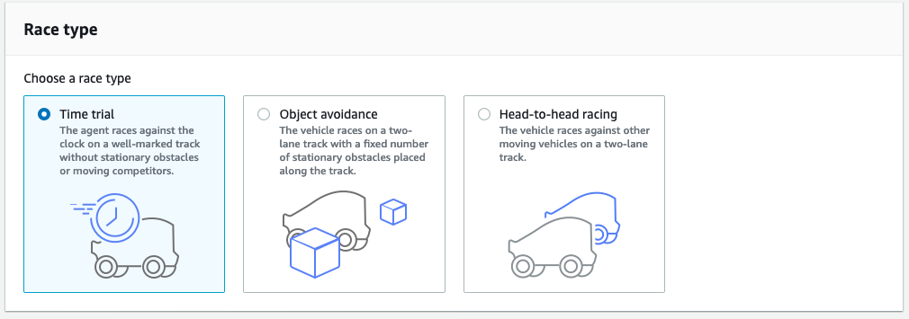
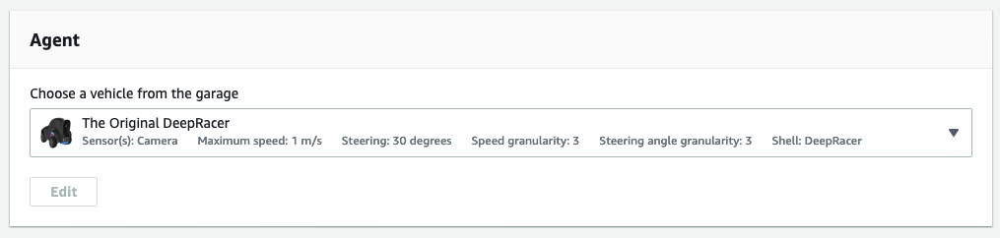
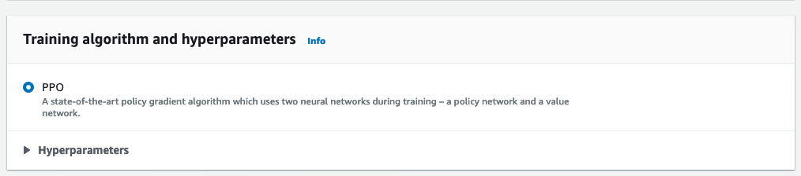
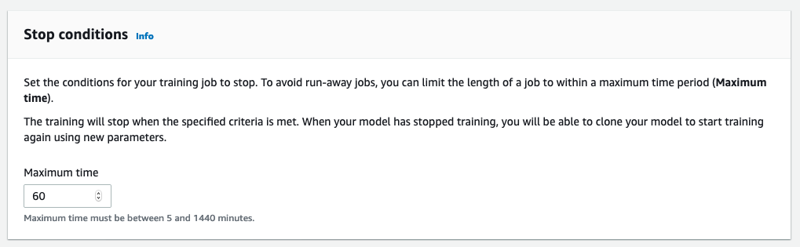
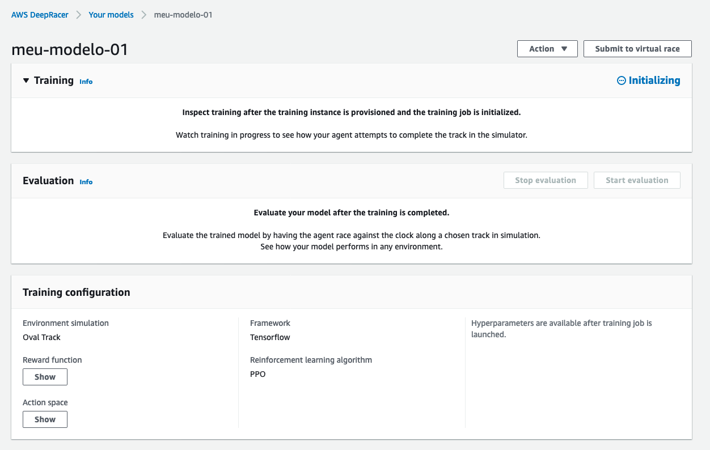
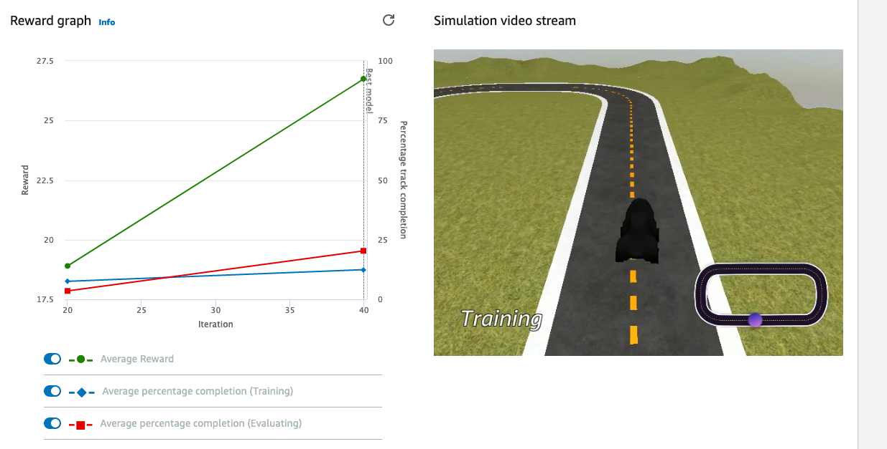

************************************************
02. Começando com AWS Deep Racer
************************************************

Treinando seu primeiro modelo
-------------------------------

O primeiro passo é entrar no console da AWS e procurar por **DeepRacer**

Após isso você irá iniciar a criação do seu modelo e definir qual a função de recompensa será utilizada para treina-lo.

Clique em ``Reinforcement learning > Your models > Create Model``

Defina um nome para o seu modelo, neste workshop utilizarei o nome **meu-modelo-01**, adicione uma descrição se quiser.

Em **Environment simulation** escolha o percurso virtual para treinar o seu modelo no DeepRacer agent (Carrinho)

.. important:: Escolha um ambiente de treinamento semelhante ou igual a pista que será utilizada na Liga que você ira subemeter o seu modelo para competição.

No workshop utilizarei a **Oval Track**

Então clique em **Next**

Selecione o tipo de corrida que você ira utilizar para treinar o seu modelo.

**Time trial** (Avaliação de tempo). O agente com a configuração padrão do sensor e com uma câmera de lente única é adequado para esse tipo de corrida sem modificações. Para obter mais informações, consulte Personalizar o treinamento do AWS DeepRacer para avaliações de tempo.

**Object avoidance** (Desvio de objetos) para contornar obstáculos estacionários colocados em locais fixos ou aleatórios ao longo da pista escolhida. O agente deve ser configurado com pelo menos uma câmera frontal de lente dupla para essas aplicações, embora uma câmera frontal de uma única lente possa ser usada para desviar de obstáculos estacionários em locais fixos. Para obter mais informações, consulte Personalizar o treinamento do AWS DeepRacer para pistas com desvio de objetos.

**Head-to-head** racing (Corridas mano a mano) para correr contra veículos bot 4 que se movem a uma velocidade constante. Além de uma câmera de lente única ou de uma câmera estéreo, o agente deve ser configurado com uma unidade LiDAR para permitir a detecção e evitar pontos cegos ao passar por outros veículos em movimento ou obstáculos estacionários. Para obter mais informações, consulte Treinamento do AWS DeepRacer para corridas mano a mano. 

Para este Workshop selecionaremos o modo **Time Trial**

.. important:: lembre-se de verificar em sua liga qual modo de corrida será utilizado.

Em **Agent** deixa o Agente do DeepRacer original.

Então clique em **Next**

Adicione agora a sua **Função de Recompensa**, para este workshop utilizaremos a função padrão de recompensa para seguir a linha do centro da pista, esse é o ponto mais importante da criação do seu modelo.

.. code-block:: python

    def reward_function(params):
        '''
        Example of rewarding the agent to follow center line
        '''
        
        # Read input parameters
        track_width = params['track_width']
        distance_from_center = params['distance_from_center']
        
        # Calculate 3 markers that are at varying distances away from the center line
        marker_1 = 0.1 * track_width
        marker_2 = 0.25 * track_width
        marker_3 = 0.5 * track_width
        
        # Give higher reward if the car is closer to center line and vice versa
        if distance_from_center <= marker_1:
            reward = 1.0
        elif distance_from_center <= marker_2:
            reward = 0.5
        elif distance_from_center <= marker_3:
            reward = 0.1
        else:
            reward = 1e-3  # likely crashed/ close to off track
        
        return float(reward)

Training algorithm and hyperparameters (Algoritmo e hiperparâmetros de treinamento), use os valores de hiperparâmetros padrão como estão.

Mais tarde, para melhorar o desempenho do treinamento, expanda Hyperparameters (Hiperparâmetros) e modifique os valores padrão dos hiperparâmetros da seguinte forma:

    Para **Gradient descent batch size** (Tamanho de lote da descida de gradiente), escolha as opções disponíveis.

    Para **Number of epochs** (Número de epochs), defina um valor válido.

    Para **Learning rate** (Taxa de aprendizado), defina um valor válido.

    Para **Entropy** (Entropia), defina um valor válido.

    Para **Discount factor** (Fato de desconto), defina um valor válido.

    Para **Loss type** (Tipo de perda), escolha as opções disponíveis.

    Para **Number of experience episodes between each policy-updating iteration** (Número de episódios de experiência entre cada iteração de atualização de política), defina um valor válido.

**Stop conditions** (Condições de interrupção), deixe o valor padrão de Maximum time (Tempo máximo) como está ou defina um novo valor para encerrar o trabalho de treinamento, para ajudar a evitar trabalhos de treinamento de longa duração (e possíveis fugitivos).

Ao experimentar na fase inicial do treinamento, você deve começar com um valor pequeno para esse parâmetro e treinar progressivamente para valores maiores de tempo. 

Por fim clique em **Create Model**

Modelo sendo treinado e Executado
----------------------------------

O processo de inicialização leva cerca de seis minutos para alterar o status de Initializing (Inicializando) para In progress (Em andamento).

O trabalho de treinamento está sendo executado na Nuvem AWS, portanto, você não precisa manter o console do AWS DeepRacer aberto durante o treinamento. No entanto, você pode voltar ao console para verificar seu modelo a qualquer momento enquanto o trabalho estiver em andamento.

Avaliando seu Modelo
----------------------------------