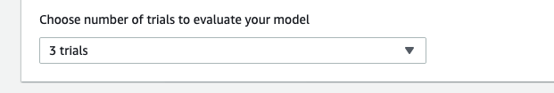

************************************************
03. Avaliando seu modelo
************************************************

Após a conclusão do trabalho de treinamento, você deve avaliar o modelo treinado para avaliar seu comportamento de convergência.

A avaliação prossegue completando uma série de testes em uma pista escolhida e fazendo com que o agente se mova na pista de acordo com ações prováveis inferidas pelo modelo treinado. As métricas de desempenho incluem uma porcentagem de conclusão da pista e o tempo de execução em cada pista, do início ao fim ou fora da pista. 

**Para avaliar um modelo treinado no console do AWS DeepRacer**

Abra o console da AWS e procure por **AWS DeepRacer** e depois em  **Reinforcement Learning** escolha **Your Models**

Clique no modelo escolhido e depois e depois em **Start evaluation**

Você pode iniciar uma avaliação depois que o status do trabalho de treinamento for alterado para **Completed (Concluído)** ou o status do modelo for alterado para **Ready (Pronto)** se o trabalho de treinamento não tiver sido concluído.

Na página **Evaluate model**, em **Evaluate criteria** escolha uma pista para fazer a avaliação do seu modelo.

.. important:: Normalmente, deseja-se escolher uma pista igual ou semelhante àquela usada no treinamento do modelo. Escolha qualquer pista para avaliar seu modelo, no entanto, espere o melhor desempenho em uma pista que seja bem semelhante àquela usada no treinamento. 

Para ver se o modelo se generaliza bem, escolha uma pista de avaliação diferente da utilizada no treinamento.

Role a página para baixo e em **Choose number of trials to evaluate your model** selecione o número de testes que deseja usar para avaliar o modelo.

Em **Race Type** selecione o tipo de corrida que você utilizou para treinar o modelo.

.. important:: Para avaliação, você pode escolher um tipo de corrida diferente do tipo de corrida usado no treinamento. Por exemplo, você pode treinar um modelo para corridas mano a mano e avaliá-lo para testes de tempo. Em geral, o modelo deverá generalizar bem se o tipo de corrida de treinamento for diferente do tipo de corrida de avaliação. Para a sua primeira execução, use o mesmo tipo de corrida para avaliação e treinamento.

Logo depois clique em **Start evaluation** para começar a criar e inicializar o trabalho de avaliação.

.. note:: Esse processo de inicialização leva cerca de 3 minutos para ser concluído.

À medida que a avaliação avança, os resultados da avaliação, incluindo o tempo de teste e a taxa de conclusão da pista, são exibidos em Evaluation (Avaliação) após cada teste. Na janela Simulation video stream (Streaming de vídeo de simulação) você pode observar como o agente se executa na pista escolhida.

Após a conclusão do trabalho de avaliação, examine as métricas de desempenho de todos os testes em Evaluation results (Resultados da avaliação). O streaming de vídeo de simulação que acompanha não está mais disponível.

.. important:: Neste trabalho de avaliação específico, o modelo treinado não consegue concluir qualquer teste. Como a primeira corrida, isso não é incomum. As possíveis razões incluem que o treinamento não convergiu e o treinamento precisa de mais tempo, o espaço de ação precisa ser ampliado para dar ao agente mais espaço para reagir, ou a função de recompensa precisa ser atualizada para lidar com ambientes variados.

.. note:: Você pode continuar a melhorar o modelo clonando um treinado anteriormente, modificando a função de recompensa, ajustando os hiperparâmetros e iterando o processo até que a recompensa total convirja e as métricas de desempenho melhorem. Para obter mais informações sobre como melhorar o treinamento, consulte Treinar e Avaliar Modelos do AWS DeepRacer - https://docs.aws.amazon.com/pt_br/deepracer/latest/developerguide/create-deepracer-project.html.