************************************************
04. Exportando e Importando seu modelo
************************************************

Nessa etapa do Workshop aprenderemos como exportar e importar nosso modelo no console DeepRacer.

Exportando seu Modelo
----------------------

É necessário que os arquivos sigam a seguinte estruturas de diretórios no S3

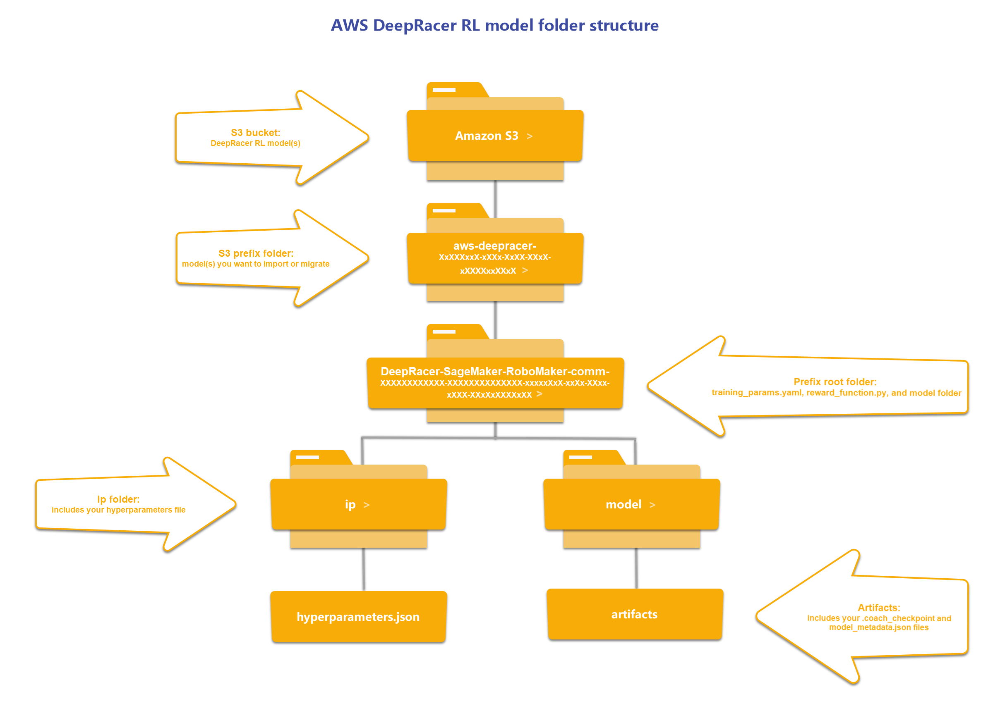

Será necessário inicialmente exportar o seu moelo do DeepRacer para um bucket S3, acesse o console do DeepRacer vá em **Your Models**

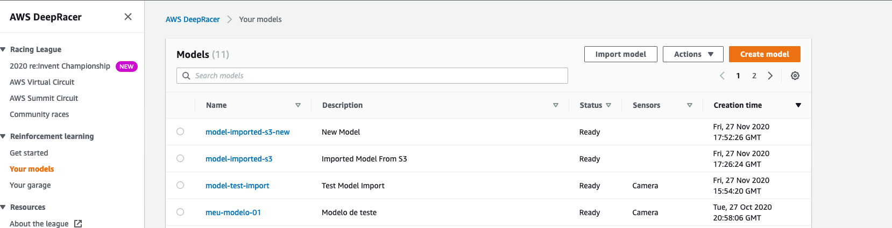

Selecione o modelo que quer exportar e clique em **Actions > Copy to S3**

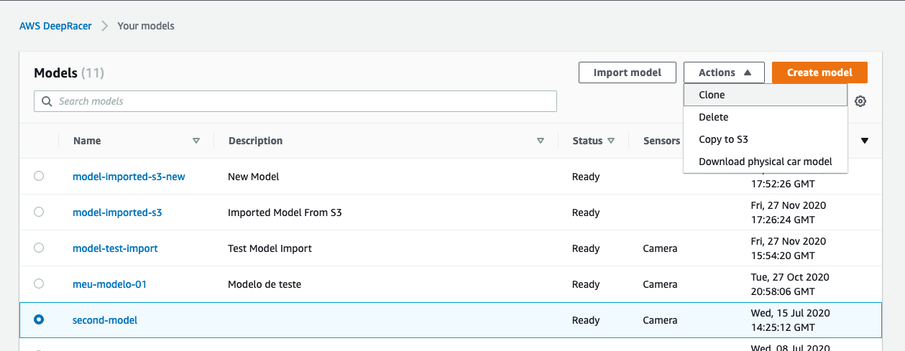

Em **S3 bucket** Selecione o bucket do DeepRacer já criado pelo próprio serviço, em **S3 object prefix (optional)** de um nome pra sua pasta onde sera armazenado o arquivo será exportado

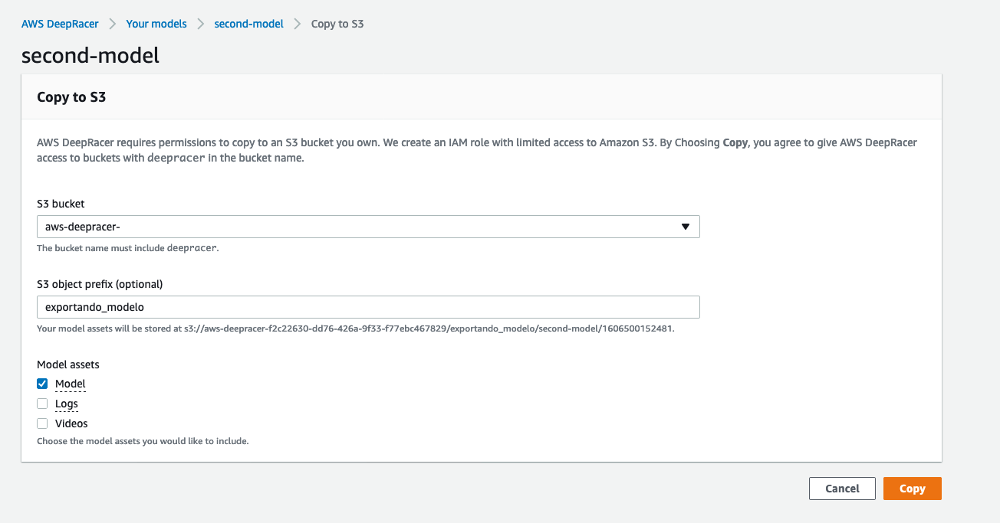

Clique em **Copy**

Agora aguarmadamente apoximadamente 1 minuto para copiar

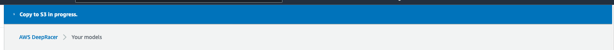

Download dos arquivos do S3
----------------------------

Será necessário o **aws-cli** devidamente configurado na sua máquina com as credenciais parar acessar o Bucket

Como configurar aws-cli - https://docs.aws.amazon.com/pt_br/cli/latest/userguide/cli-chap-configure.html

Vá até o bucket que você exportou o seu modelo e copie o S3 URI

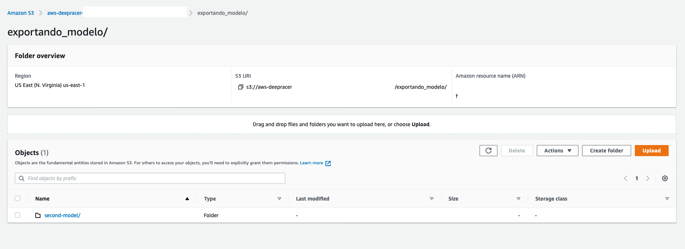

No meu caso **s3://aws-deepracer-xxxxx-xxxx-xxxx/exportando_modelo/**

Abra o seu terminal com as credenciais configuradas

Crie uma pasta para fazer download dos seus modelos

Siga os passos abaixo

**mkdir meu_modelo_exportado**

**cd meu_modelo_exportado**

**aws s3 cp -r aws s3 cp --recursive s3://aws-deepracer-xxxxx-xxxxx-xxxxx/exportando_modelo/ ./**

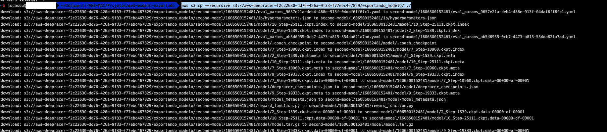

Após finalizdo o seu modelo já estará em sua máquina local e você pode re-importalo no console do DeepRacer

Importando Seu Modelo
---------------------- 

O procedimento abaixo leva em conta que você possua o **aws-cli** devidamente instalado e configurado em seu computador.

Vamos considerar para este exercício, que você tenha a estrutura de seu modelo em sua máquina. O que será algo semelhante a imagem abaixo:

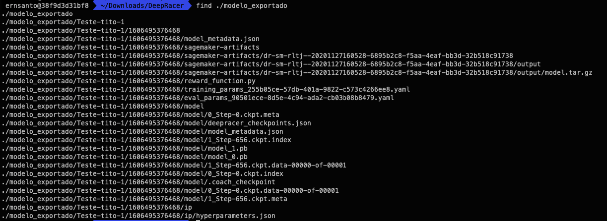

Em seu terminal, vá então para o diretório onde está a estrutura de modelo que você pretende importar.

Exemplo de comando abaixo (substitua <caminho>/<modelo_exportado>, pelo caminho correto em sua máquina):

::

cd /<caminho>/<modelo_exportado>

Aqui um exemplo de como seria uma execução deste:

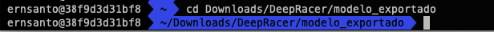

Vamos então criar um novo bucket, o qual irá abrigar esta estrutura deste modelo.

Exemplo de comando abaixo (substitua o <nome_do_bucket>, pelo nome que você escolheu para seu bucket):

::

aws s3 mb s3://<nome_do_bucket> --region us-east-1

Aqui um exemplo de como seria uma execução deste:

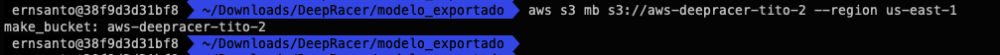

Como estando no diretório onde está a estrutura do modelo que desejamos importar, vamos efetuar uma cópia recursiva de toda esta estrutura para dentro do bucket recém criado.

Exemplo de comando abaixo (substitua o <nome_do_bucket>, pelo nome que você escolheu para seu bucket):

::

aws s3 cp . s3://<nome_do_bucket> --recursive

Aqui um exemplo de como seria uma execução deste comando:

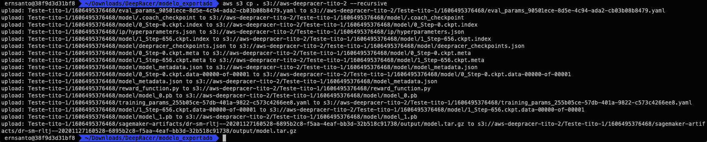

Após realizar o upload da estrutura do modelo para o bucket, precisamos autorizar que o Deepracer tenha acesso ao bucket, criando para isso uma "bucket policy".

Para isso vá até o AWS Console, acesse seu bucket e faça a inclusão da "bucket policy".

Abaixo um exemplo:

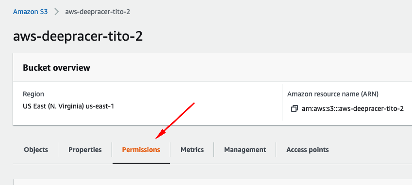

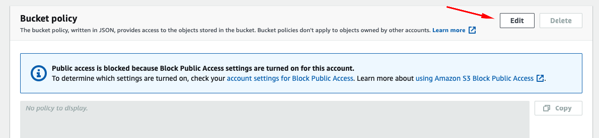

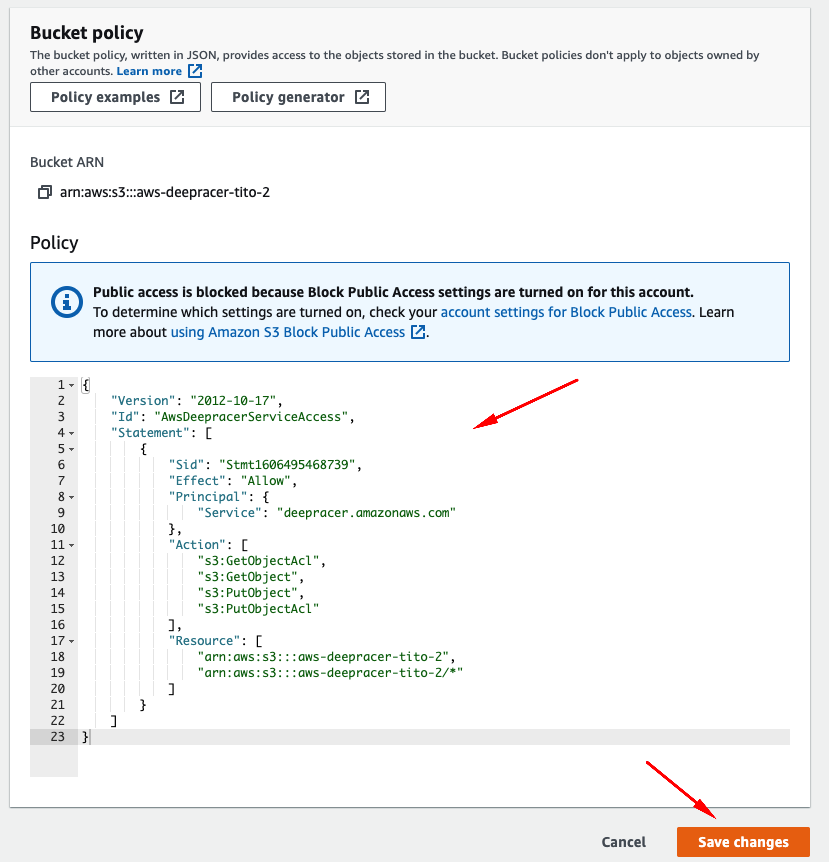

Aqui está um exemplo de como seria esta bucket policy (substitua o <nome_do_bucket>, pelo nome que você escolheu para seu bucket):

::

{
    "Version": "2012-10-17",
    "Id": "AwsDeepracerServiceAccess",
    "Statement": [
        {
            "Sid": "Stmt1606495468739",
            "Effect": "Allow",
            "Principal": {
                "Service": "deepracer.amazonaws.com"
            },
            "Action": [
                "s3:GetObjectAcl",
                "s3:GetObject",
                "s3:PutObject",
                "s3:PutObjectAcl"
            ],
            "Resource": [
                "arn:aws:s3:::<nome_do_bucket>",
                "arn:aws:s3:::<nome_do_bucket>/*"
            ]
        }
    ]
}

Vá então para o serviço AWS Deepracer, clique em "Your models", e depois clique em "Import model".

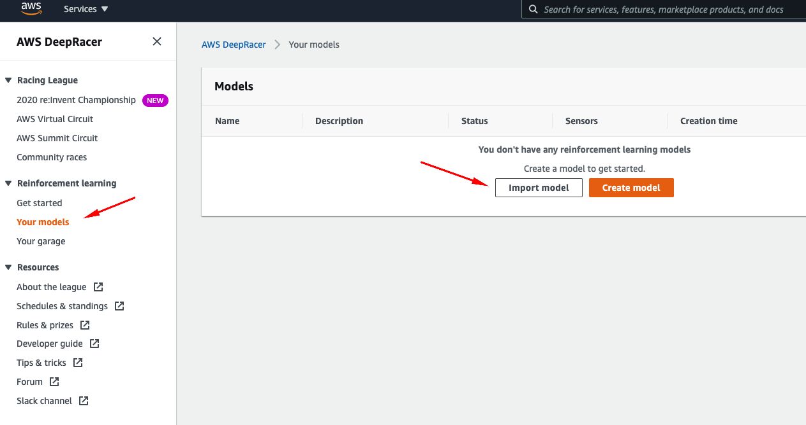

Na tela onde passamos as informações para a importação necessitaremos indicar os seguintes dados:

"Sepecific S3 bucket", onde indicamos: "s3://<nome_do_bucket>/<prefix>". 
Este caminho indicará ao Deepracer em qual o diretório base ele encontrará as informações do modelo a ser importado.

"Model name", onde você indica qual nome dará a seu modelo importado.

Considerando os exemplo utilizados acima, aqui está um exemplo de como ficaria:

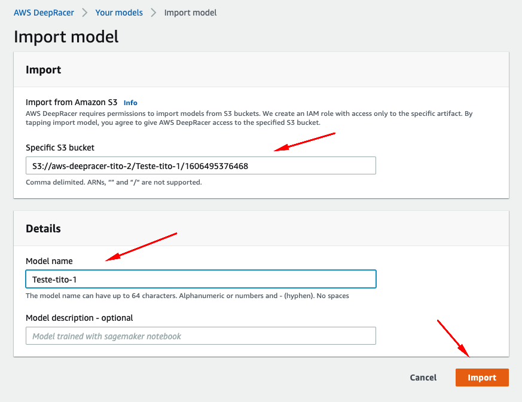

O próximo passo será aguardar que a importação aconteça.

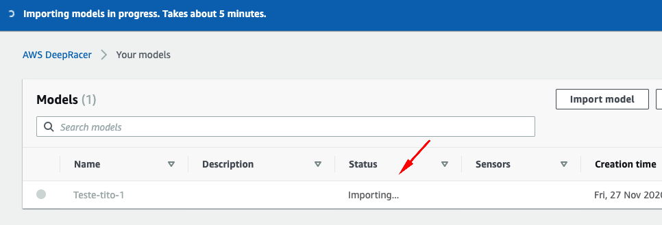

Após alguns minutos, teremos nosso modelo importado.

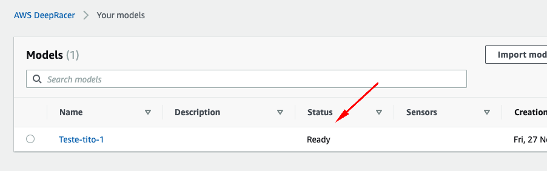

Exportando Seu Modelo Físico
-----------------------------