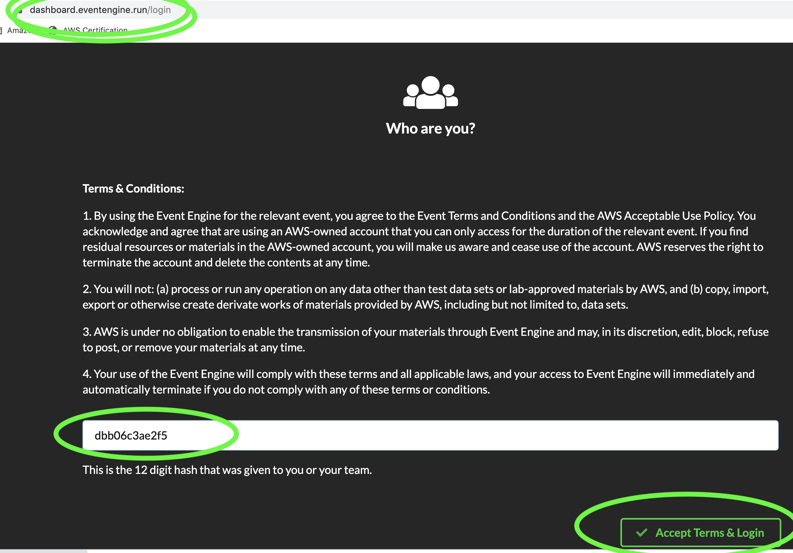
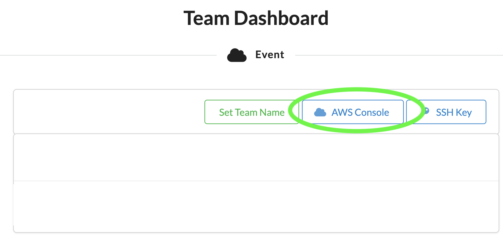

************************************************
DeepRacer League Workshop
************************************************

.. image:: https://readthedocs.org/projects/workshop-amazon-sagemaker/badge/?version=latest
   :target: https://workshop-amazon-sagemaker.readthedocs.io/pt/latest/?badge=latest
   :alt: Documentation Status

Nesse workshop iremos explorar o funcionamento do DeepRacer e como criar a sua primeira função de recompensa, além de entender o que é Reinforcement Learning 

Também treinaremos o nosso modelo utilizando nossa função de recompensa para submete-lo a uma liga, seja ela privada ou pública

Antes de começarmos
--------------------
.. note:: Caso esteja efetuando esse workshop acompanhado(a) de algum(a) organizador(a) da AWS verifique se o Event Engine estará disponível para o workshop.

.. important:: Execute o workshop na região de N.Virgínia (us-east-1).

Acesse a página da plataforma **Event Engine**: https://dashboard.eventengine.run/login

Entre o **"hash" de 12 dígitos** que o(a) organizador(a) da AWS providenciou e clique em **"Accept Terms & Login"**:

Clique em **AWS Console** e após isso em **Open AWS Console**

.. image:: _static/intro_03.png

Pronto! Agora que já temos uma conta AWS disponível podemos prosseguir com o workshop.

.. toctree::
   :caption: Etapas do Workshop:
   :maxdepth: 2

   reinforcement_learning
   deep_racer_model
   evaluate_model

