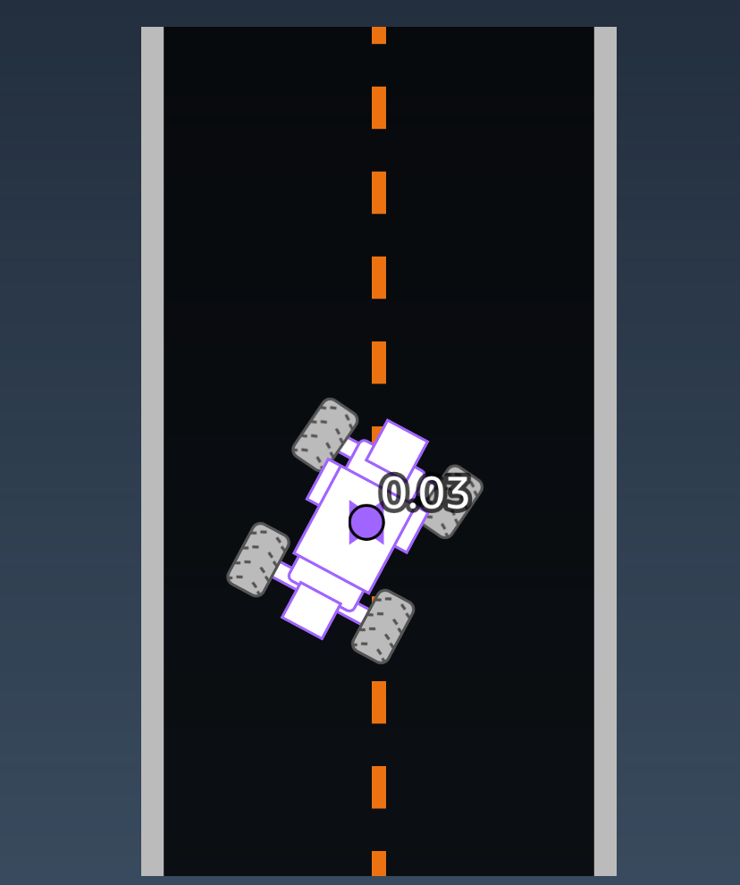

************************************************
01. Entendendo Reinforcement Learning
************************************************

Nesta etapa do Workshop entenderemos o que é Reinforcement Learning e como ele é aplicado no AWS DeepRacer

.. note:: Este módulo é baseado na seguinte documentação oficial da AWS em inglês https://d2k9g1efyej86q.cloudfront.net/

O que é Reinforcement Learning?
-----------------------------------------

Reinforcement learning (RL) é um tipo de machine learning, onde um agente explora um ambiente e aprende como performar as tasks desejadas ganhando pontos caso o resultado seja bom e perdendo pontos caso o resultado seja ruim.

Um modelo de Reinforcement Learning irá aprender baseado na sua experiência e com o tempo será capaz de identificar quais ações geram as melhores recompensas.

Como o AWS DeepRacer aprende a dirigir sozinho?
------------------------------------------------

No Reinforcement learning, um agente dentro de um ambiente tem um objetivo de maximizar o ganho, dessa maneira o agente toma açoes baseado no estado do ambiente e retorna uma recompensa.

.. note:: O Apredizado no Reinforcement Learning é por tentativa e erro, inicialmente tomando ações de maneira aleatória.

Agente
*****************

Ambiente
*****************

Ação
*****************

Uma ação é o movimento realizado pelo agente no estado atual, para o AWS DeepRacer uma ação corresponde a mover-se em uma velocidade, ângulo e direção particulares. 

Recompensa
*****************

É a pontuação dada como feedback para o agente quando ele toma uma ação em um determinado estado.

.. note:: No AWS DeepRacer a recompensa é realizada utilizando uma reward function, criaremos nossa primeira função mais a frente no Workshop 

Como treinar um modelo de Reinforcement Learning?
--------------------------------------------------

**Um ambiente simples**

Abaixo temos uma demonstração de um ambiente simples onde o objetivo é o carrinho (agente) ir do início até a linha de chegada.

**Pontuação**

Como o nosso Objetivo é que o carrinho vá de um lado para o outro percorrendo o centro, em cada quadrado adicionamos uma pontuação, pelo meio a pontuação é maior já pelo caminho indesejado é menor.

Dessa maneira o objetivo é que baseado em uma quantidade X de **iterações** o nosso agente seja capaz de escolher o melhor caminho.

Baseado nas iterações do agente, ele vai adiquirindo cada vez mais experiência, aprendendo a ficar no centro da pista assim ganhando mais pontos.

.. image:: _static/reinforcment_learning/pista01.png 

.. image:: _static/reinforcment_learning/grafico01.png

Quanto mais tempo de treinamento do modelo e a estratégia de função de recompensa o agente é capaz de atingir o destino de forma mais rápida

.. image:: _static/reinforcment_learning/pista02.png 

Paramêtros de uma função de recompensa
--------------------------------------------------

No AWS DeepRacer a função de recompensa é uma função em Python com um certo número de paramêtros que descrevem o estado atual e retorna uma recompensa númerica

**Vamos explorar alguns desses paramêtros abaixo**

Position on Track
******************

Os paramêtros ``x`` e ``y`` descrevem a posição do carro em metros.

Heading
******************

O paramêtro ``heading`` descreve a orientação do carro em graus.

Waypoints
******************

Os ``waypoints`` é uma lista de pontos colocados ao longo da pista, cada um desses pontos é um par de coordenadas ``[x, y]``

Track width
******************

``track_width`` é o paramêtro que mede a largura da pista em metros

Distance from center line
**************************

``distance_from_center`` paramêtro mede a distancia do carro para o centro da pista.

``is_leftof_center`` é um paramêtro booleano que descreve quando o carro está no lado esquerdo da pista.

All wheels on track
*********************

``all_wheels_on_track`` é um paramêtro booleano que retorna ``true`` se todas as rodas do carro estiverem na pista.

Speed
*********************

``speed`` é o paramêtro que mede a velocidade do carro, medido em metros por segundo.

Steering angle
********************

``steering_angle`` mede o angulo de direção do carro, medido em graus.

Este valor é negativo se o veículo estiver virando para a direita e positivo se o veículo estiver virando para a esquerda.

**Para meis informações consulte o link:** https://docs.aws.amazon.com/deepracer/latest/developerguide/deepracer-console-train-evaluate-models.html#deepracer-reward-function-signature

A Função de recompensa
--------------------------------------------------

A seguir veremos algumas funções de recompensas criadas para realizar objetivos especificos, como por exemplo, permanecer na pista, andar no centro, entrou outras.

Ficar na pista
********************

Nesse exemplo nós damos uma recompensa alta quando o carro fica dentro da pista, e penalizamos caso o carro saia da pista.

.. code-block:: python

    def reward_function(params):
        '''
        Example of rewarding the agent to stay inside the two borders of the track
        '''

        # Read input parameters
        all_wheels_on_track = params['all_wheels_on_track']
        distance_from_center = params['distance_from_center']
        track_width = params['track_width']

        # Give a very low reward by default
        reward = 1e-3

        # Give a high reward if no wheels go off the track and
        # the agent is somewhere in between the track borders
        if all_wheels_on_track and (0.5*track_width - distance_from_center) >= 0.05:
            reward = 1.0

        # Always return a float value
        return float(reward)

Seguir a linha central
***********************

Nesse exemplo nós medimos o quão distante o carro está do centro da pista, damos uma recompensa alta caso o carro esteja próximo ao centro.

.. code-block:: python

    def reward_function(params):
        '''
        Example of rewarding the agent to follow center line
        '''

        # Read input parameters
        track_width = params['track_width']
        distance_from_center = params['distance_from_center']

        # Calculate 3 markers that are at varying distances away from the center line
        marker_1 = 0.1 * track_width
        marker_2 = 0.25 * track_width
        marker_3 = 0.5 * track_width

        # Give higher reward if the car is closer to center line and vice versa
        if distance_from_center <= marker_1:
            reward = 1.0
        elif distance_from_center <= marker_2:
            reward = 0.5
        elif distance_from_center <= marker_3:
            reward = 0.1
        else:
            reward = 1e-3  # likely crashed/ close to off track

        return float(reward)

.. note:: Parabéns, você chegou ao final deste módulo e um pouco melhor sobre, Reinforcement Learning, Deep Racer e suas funções de recompensa, vá para o próximo módulo para aprender a criar e treinar seu primeiro modelo.

.. toctree::
   :caption: Etapas do Workshop:
   :maxdepth: 2

   deep_racer_model
   evaluate_model